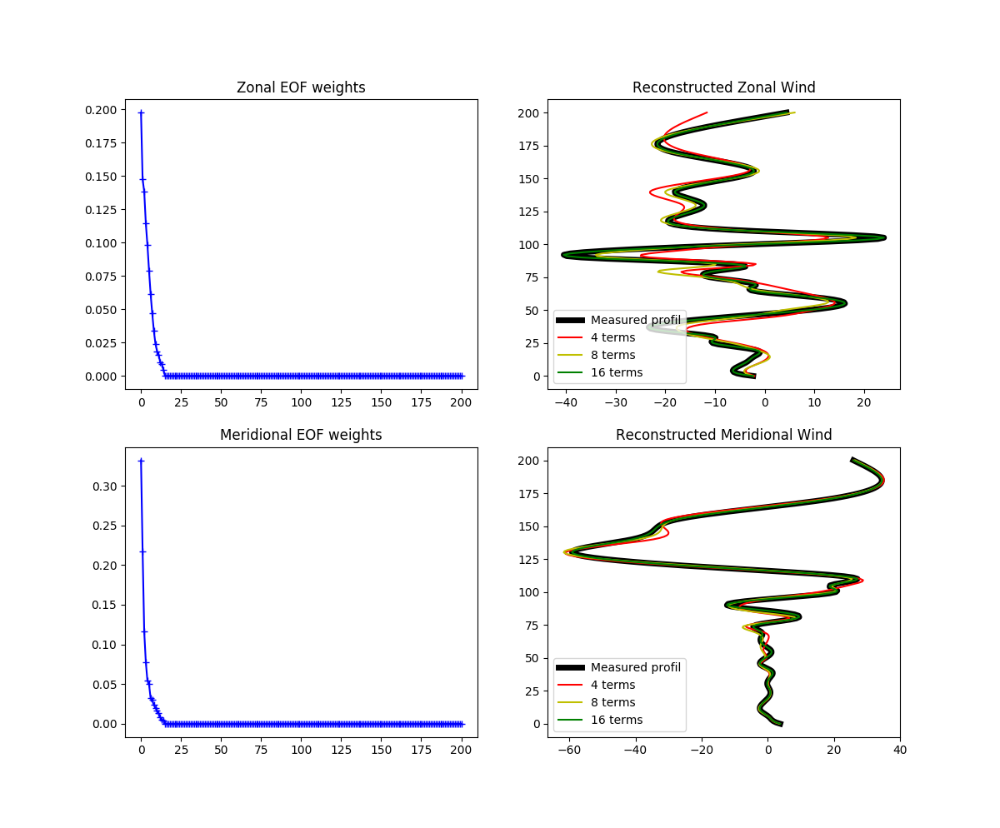

=======
eof_hwm
=======

This code only reproduces the decomposition on Empirical Orthogonal functions of the wind profile given by the HWM2014 model.

Example 
=========

References 
==========

.. The idea was to reproduce the study conducted in the article: `The estimation of upper atmospheric wind model updates from infrasound data <https://agupubs.onlinelibrary.wiley.com/doi/pdf/10.1002/jgrd.50833>` by J. D. Assink, R. Waxler, W. G. Frazier, and J. Lonzaga 

.. The data from HWM2014 are available on <https://github.com/rilma/pyHWM14>
